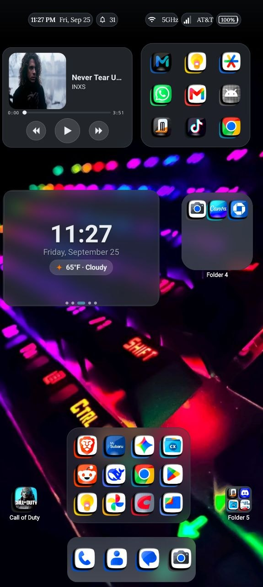
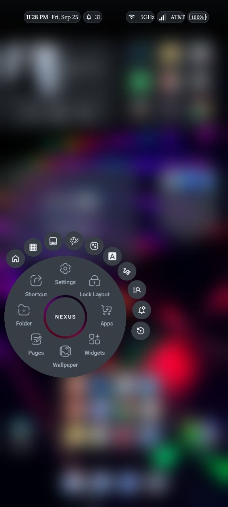
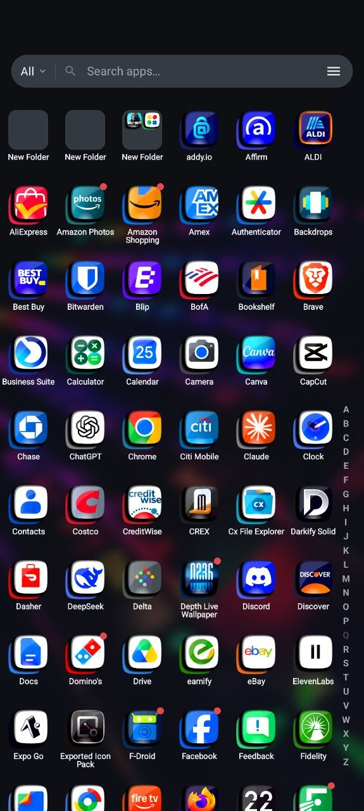
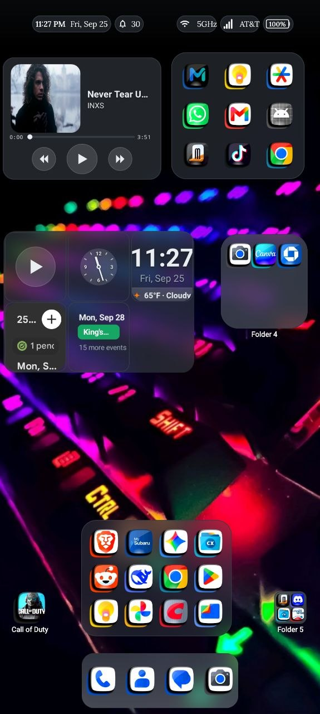
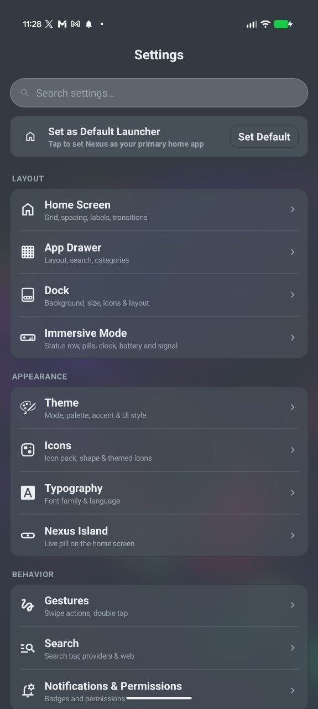

# Nexus Launcher (Showcase Edition)

Nexus Launcher is a high-performance, single-Activity Android launcher engineered in Kotlin, leveraging Hilt for dependency injection, Room for reactive local persistence, and Jetpack DataStore Preferences for settings management. Built upon a unified, zero-allocation custom Canvas rendering pipeline rather than heavy view hierarchies, it delivers fluid transitions, sub-millisecond touch hit-testing, and dynamic spatial layouts across device form factors.

> **Note:** Showcase snapshot of a launcher in active private development; some features are omitted.

  
  
  

  <em>Left: Home Screen & Living Mosaic &nbsp;&bull;&nbsp; Center: Radial Edit Menu & Workspace Blur &nbsp;&bull;&nbsp; Right: 5-Column Fast App Drawer</em>

---

## Technical Highlights (Data & Systems)

This repository showcases real-world systems architecture, reactive data processing, and complex schema transformations:

### 1. Relational Database Architecture & Schema Evolution (Room Migrations)
- **Database Schema ([LauncherDatabase.kt](app/src/main/java/com/nexus/launcher/data/LauncherDatabase.kt)):** Room database managing multi-entity home screen layouts, folder structures, widget metadata, and shape-specific coordinate tables.
- **Migration History (1 -> 17) ([DatabaseModule.kt](app/src/main/java/com/nexus/launcher/di/DatabaseModule.kt)):** Demonstrates comprehensive, non-destructive schema migrations over 17 revisions, featuring database triggers, schema normalization, additive migrations, and data backfilling on `Dispatchers.IO`.

### 2. Nova Backup Importer (ETL & Coordinate Remapping Pipeline)
- **Data Persistence & Transaction Execution ([NovaImportPersist.kt](app/src/main/java/com/nexus/launcher/ui/backup/NovaImportPersist.kt)):** Safely extracts, sanitizes, and persists foreign launcher backups inside an atomic Room transaction.
- **Foreign SQLite & XML Parsing ([NovaImporter.kt](app/src/main/java/com/nexus/launcher/ui/backup/NovaImporter.kt)):** An end-to-end ETL pipeline that directly queries foreign `.novabackup` SQLite databases and XML preference manifests, strips proprietary serialized Intents, handles coordinate translation between differing grid densities, and rebinds app widgets.
- **Drawer Category Mapping ([NovaDrawerImporter.kt](app/src/main/java/com/nexus/launcher/ui/backup/NovaDrawerImporter.kt)):** Ingests and remaps foreign category and folder data models.

### 3. Search, Tokenization & Evaluation Engine
- **Search & Inline Calculator Engine ([NexusSearchEngine.kt](app/src/main/java/com/nexus/launcher/search/NexusSearchEngine.kt)):** Real-time asynchronous search orchestrator combining prefix filtering, tokenized keyword matching, and inline mathematical calculations.
- **Result Pipeline & Custom Rendering ([NexusSearchResultRenderer.kt](app/src/main/java/com/nexus/launcher/search/ui/NexusSearchResultRenderer.kt)):** Renders categorized matches, app actions, and calculator results directly to custom views with zero extraneous allocations.
- **Smart Categorization Engine ([CategoryEngine.kt](app/src/main/java/com/nexus/launcher/domain/search/CategoryEngine.kt)):** Performs whole-word token classification and taxonomy matching to automatically group application packages.

### 4. Algorithmic Grid Coordinate Mapping & Multi-Shape Derivation
- **Adaptive Grid Transformation ([GridCellPlanner.kt](app/src/main/java/com/nexus/launcher/data/GridCellPlanner.kt)):** Pure-Kotlin algorithmic layout deriver that projects and folds 2D spatial coordinate grids dynamically across phone portrait, phone landscape, and large-screen foldable orientations.
- **Spatial Coordinate Space ([CellFractionConverter.kt](app/src/main/java/com/nexus/launcher/ui/canvas/CellFractionConverter.kt)):** Converts discrete integer grid matrix positions into resolution-independent fractional coordinates to support arbitrary device aspect ratios.
- **Collision Detection & Occupancy Matrix ([GridOccupancyHelper.kt](app/src/main/java/com/nexus/launcher/ui/canvas/GridOccupancyHelper.kt)):** High-performance 2D bounding-box spatial collision detection and cell availability planning.

### 5. Living Mosaic Dynamic Layout Architecture
- **Dynamic Tessellation View ([LivingMosaicView.kt](app/src/main/java/com/nexus/launcher/ui/widgets/mosaic/LivingMosaicView.kt)):** A custom multi-tile container that computes asymmetric grid spans and draws elevated Neumorphic surface shadows.
- **Layout Resolver & Frame Geometry ([MosaicContentFrame.kt](app/src/main/java/com/nexus/launcher/ui/widgets/mosaic/MosaicContentFrame.kt)):** Orchestrates nested sub-widget geometry, hit-testing bounds, and clip regions for composite mosaic items.
- **Gesture Coordination & Carousel Controller ([MosaicFocusController.kt](app/src/main/java/com/nexus/launcher/ui/widgets/mosaic/MosaicFocusController.kt)):** Coordinates focus zoom transitions and carousel swipe delegation without dropping touch events to parent canvas layers.

---

## How I Use AI

Software engineering with AI agents is a core part of my development workflow. Rather than using AI for vague autocomplete, I design strict engineering constraints, architectural rules, single-source-of-truth geometry models, and automated verification loops.

See the complete guidelines and prompt architecture:
- [Agent Guidelines & Hard Invariants](docs/ai-workflow/AGENTS.md)
- [Agent Prompt Template & Verification Standard](docs/ai-workflow/PROMPT_TEMPLATE.md)

---

  
  
  

  <em>Left: Custom Widgets & Dock &nbsp;&bull;&nbsp; Center: Dispatchers.IO RSS Feed Pipeline &nbsp;&bull;&nbsp; Right: Reactive DataStore Settings Hub</em>

---

Proprietary Source Showcase. All rights reserved. This repository is made publicly available solely for portfolio review and technical evaluation.
